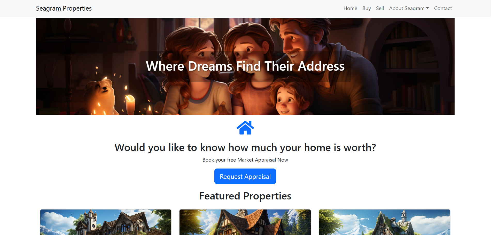
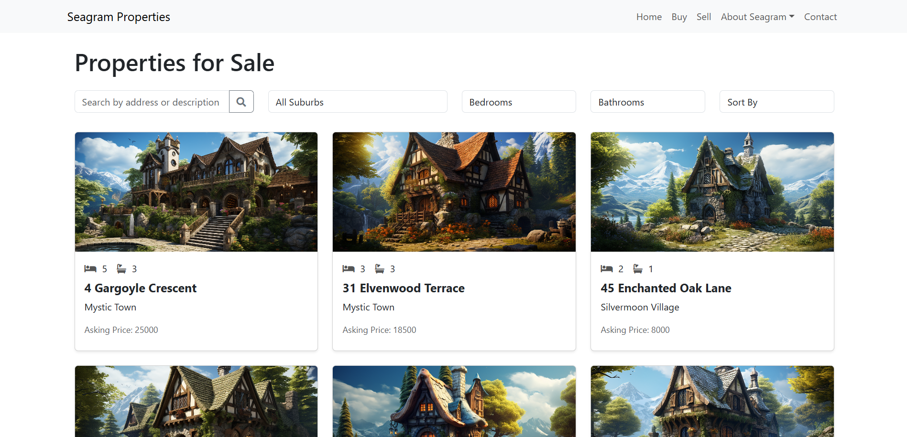
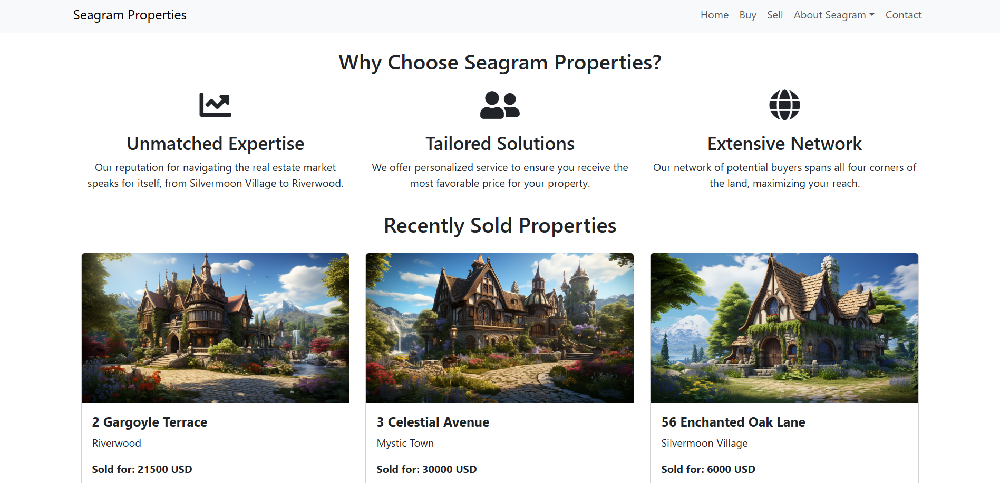
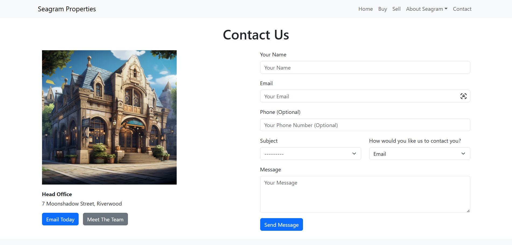

# Seagram Properties

Seagram Properties is a fictional real estate website built with Django as a personal learning project to practice web development skills. The company and data (including people and properties) are fictional and do not intend to represent any real company, person, or property. A live demo is available at https://seagram-django.onrender.com.

## Features
- Property Listings: Displays properties for sale with details such as address, price, status, suburb, number of bedrooms and bathrooms, and photos. Includes filtering by suburb, bedrooms, bathrooms, and a search feature for address or description, with sorting options for price and listing date.
- Property Details: Each property has a dedicated detail page showing all relevant information, including a "Contact Us" button that pre-fills a contact form with a message about the specific property.
- Contact Form: Users can submit inquiries with options for subject (for example: buying or selling) and preferred contact method, with validation to ensure required fields are filled.
- Sales Request Form: Allows users to request a market appraisal for selling their property, with similar validation.
- Responsive Design: Uses Bootstrap to ensure the site is mobile-friendly and visually appealing across devices.

## Tech Stack
- Backend: Django
- Frontend: Bootstrap
- Database: SQLite
- Deployment: Docker containerization with OnRender hosting

## Live Demo
A live demo of the application is available at https://seagram-django.onrender.com. Note that this demo is for demonstration purposes only and is not intended for production use. It is deployed with DEBUG=True for development purposes, which may expose additional information for debugging.

## Screenshots

Below are some screenshots showcasing the Seagram Properties website.

### Home Page

### Buy Page

### Sell Page

### Contact Page

## Notes
This is a personal learning project for practicing Django. The company and data (including people and properties) are fictional and do not intend to represent any real company, person, or property. While there is a live demo, this application is not intended to be used for production purposes. The images used in this demo (such as the properties and portraits) were generated using an AI Image-Generation tool called Midjourney. 

